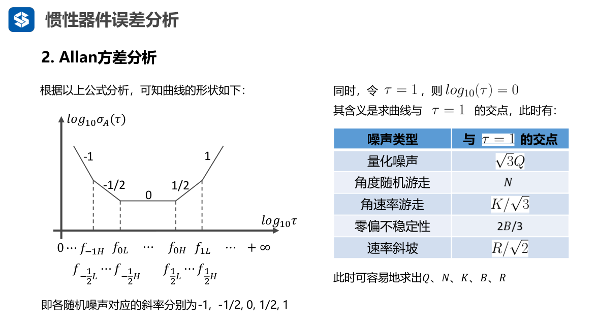
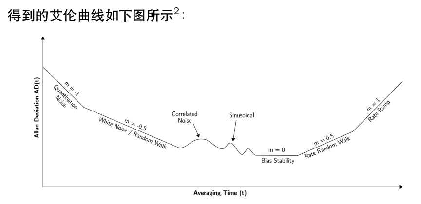
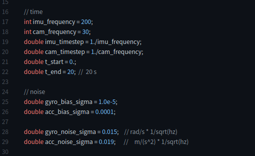
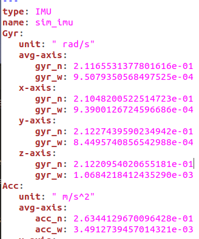
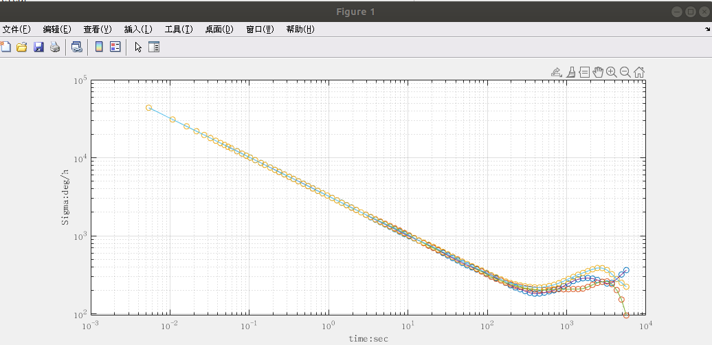
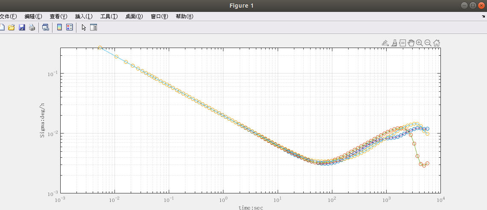
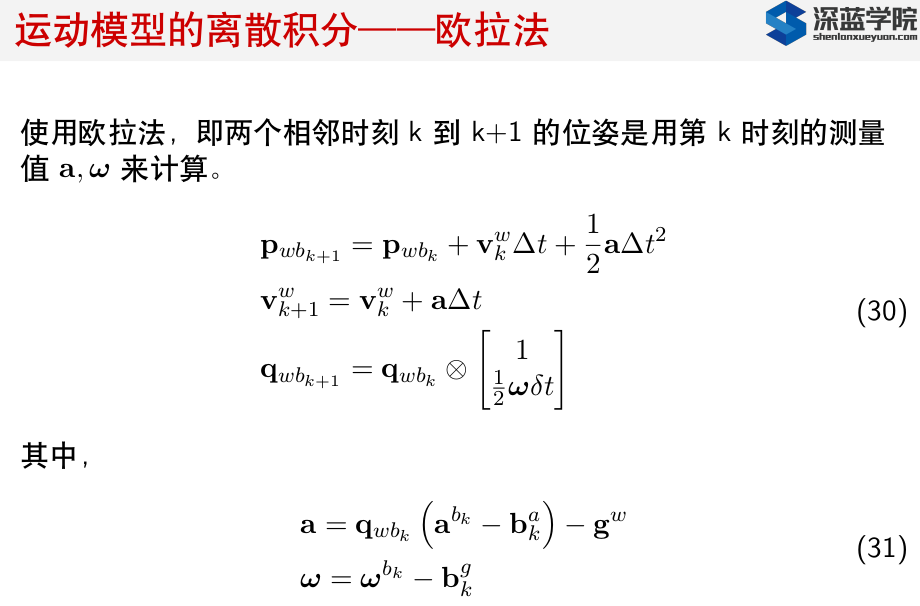
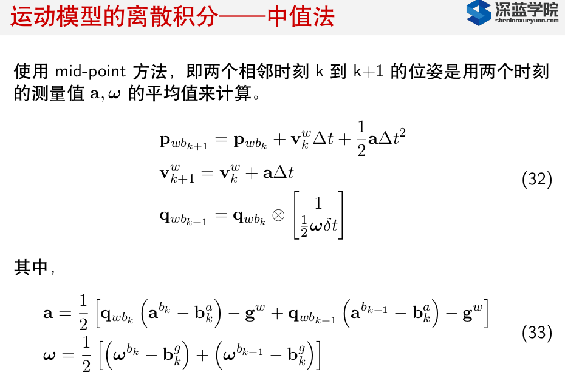
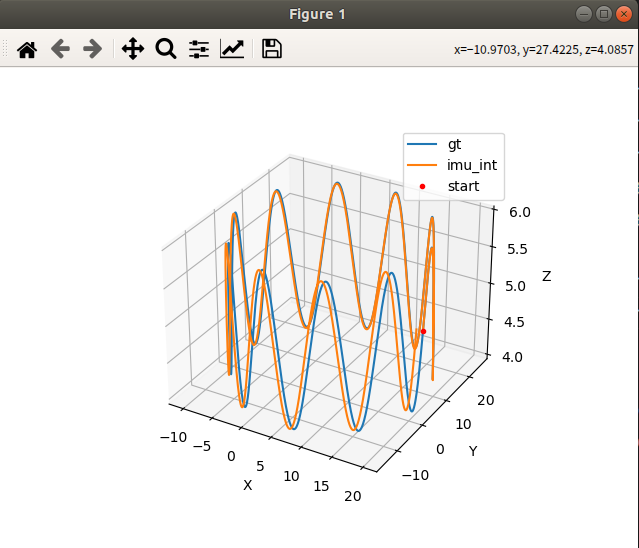
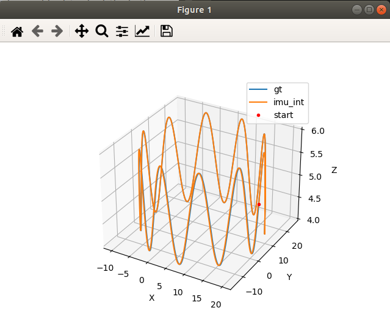

# 第二章 IMU传感器

课程代码：

[https://github.com/kahowang/Visual_Internal_Odometry/tree/main/%E7%AC%AC%E4%BA%8C%E7%AB%A0%20IMU%E4%BC%A0%E6%84%9F%E5%99%A8/homework_chapter2](https://github.com/kahowang/Visual_Internal_Odometry/tree/main/%E7%AC%AC%E4%BA%8C%E7%AB%A0%20IMU%E4%BC%A0%E6%84%9F%E5%99%A8/homework_chapter2)

参考博客：

[深蓝学院《从零开始手写VIO》作业2](https://blog.csdn.net/hitljy/article/details/107553751)

[使用imu_utils工具生成IMU的Allan方差标定曲线](https://blog.csdn.net/u011392872/article/details/95787486?utm_source=distribute.pc_relevant.none-task)

[惯导笔记 - 传感器误差分析](https://blog.csdn.net/luoshi006/article/details/82657017)

## 1.生成仿真数据集，标定Allan方差

### 1.1.惯性器件的噪声分析

#### 多传感器融合定位笔记(任乾)：

信号噪声的组成;

1)**量化噪声**

​		一切量化操作所固有的噪声,是数字传感器必然出现的噪声;
​		产生原因:通过AD采集把连续时间信号采集成离散信号的过程中,精度会损失,精度损失的大小和AD转换的步长有关,步长越小,量化噪声越小。

2)**角度随机游走**

​		宽带角速率白噪声:陀螺输出角速率是含噪声的,该噪声中的白噪声成分;
​		产生原因:计算姿态的本质是对角速率做积分,这必然会对噪声也做了积分。白噪声的积分并不是白噪声,而是一个马尔可夫过程,即当前时刻的误差是在上一时刻误差的基础上累加一个随机白噪声得到的。
角度误差中所含的马尔可夫性质的误差,称为角度随机游走。

3)**角速率随机游走**

​		与角度随机游走类似,角速率误差中所含的马尔可夫性质的误差,称为角速率随机游走。而这个马尔可夫性质的误差是由宽带角加速率白噪声累积的结果。

4)**零偏不稳定性噪声**

​		零偏:即常说的bias,一般不是一个固定参数,而是在一定范围内缓慢随机飘移。
​		零偏不稳定性:零偏随时间缓慢变化,其变化值无法预估,需要假定一个概率区间描述它有多大的可能性落在这个区间内。时间越长,区间越大。

5)**速率斜坡**

​		该误差是趋势性误差,而不是随机误差。
​		随机误差,是指你无法用确定性模型去拟合并消除它,最多只能用概率模型去描述它,这样得到的预测结果也是概
率性质的。
​		趋势性误差,是可以直接拟合消除的,在陀螺里产生这种误差最常见的原因是温度引起零位变化,可以通过温补来
消除。

6)**零偏重复性**

​		多次启动时,零偏不相等,因此会有一个重复性误差。在实际使用中,需要每次上电都重新估计一次。
​		Allan方差分析时,不包含对零偏重复性的分析。




#### VIO 笔记(贺一家)

误差分类：

​		加速度计和陀螺仪的误差可分为：确定性误差，随机误差。

​		确定性误差可以事先标定确认，包括：bias，scale  ...

​		随机误差通常假设噪声服从高斯分布，包括：高斯白噪声，bias随机游走



### 1.2 生成 ROS的imu数据集合

```shell
mkdir vio_sim_ws/src 
#将vio_data_simulation-ros_version  放进src中
catkin_make 
rosrun vio_data_simulation vio_data_simulation_node    # 生成 imu.bag 数据集
```

```shell
rqt_bag  info  imu.bag  # 查看当前数据包的内容
path:        imu.bag
version:     2.0
duration:    3hr 59:59s (14399s)
start:       Feb 24 2022 13:04:10.04 (1645679050.04)
end:         Feb 24 2022 17:04:10.04 (1645693450.04)
size:        1.0 GB
messages:    2880001
compression: none [1344/1344 chunks]
types:       sensor_msgs/Imu [6a62c6daae103f4ff57a132d6f95cec2]
topics:      imu   2880001 msgs    : sensor_msgs/Imu
```

### 1.3 imu_utils  完成allan 标定

### 1.3 imu_utils  完成allan 标定

编译，安装 imu_utils 工具包，主要参考网址：

[LIO-SAM运行自己数据包遇到的问题解决--SLAM不学无数术小问题]( https://blog.csdn.net/weixin_42141088/article/details/118000544#commentBox)  

[用imu_utils标定IMU，之后用于kalibr中相机和IMU的联合标定](https://blog.csdn.net/fang794735225/article/details/92804030#commentBox)

[使用imu_utils工具生成IMU的Allan方差标定曲线](https://blog.csdn.net/u011392872/article/details/95787486?utm_source=distribute.pc_relevant.none-task)

**注意**：code_utils 和 imu_utils 有先后顺序，不能放在一起编译   

FILE :  imu_utils_ws/src/imu_utils/launch  新建 sim_imu.launch

```xml
<launch>
    <node pkg="imu_utils" type="imu_an" name="imu_an" output="screen">
        <param name="imu_topic" type="string" value= "/imu"/>				<!--imu ROS话题  /imu -->
        <param name="imu_name" type="string" value= "sim_imu"/>
        <param name="data_save_path" type="string" value= "$(find imu_utils)/data/"/>	<!--保存表标定完毕后数据路径-->
        <param name="max_time_min" type="int" value= "230"/>		<!--读取数据的最大时间-->
        <param name="max_cluster" type="int" value= "100"/>
    </node>
</launch>
```

```shell
roslaunch imu_utils sim_imu.launch
rosbag  play  imu.bag  -r  500    # 以500倍速播放
```

标定结果： FILE :  imu_utils_ws/src/imu_utils/data

注意： sim_imu  预设置的噪声 单位为 gyro : rad/(s * sqrt(hz))  acc :  m/(s^2*sqrt(hz)) ， 而imu_utils 预设的的噪声单位为 gyro: rad/s   acc: m/s^2。统一单位时，需要将imu_utils 的结果都除以 sqrt(hz) , sim_imu 的 采样频率为200hz , 所以 imu_utils 的结果都需要除以 sqrt(200) = 14.14

仿真imu数据，预设的imu_noise 单位

仿真imu数据，预设的imu_noise 单位

 

imu_utils 标定后的单位



| 误差类型               | 真值  rad/(s * sqrt(hz))    m/(s^2*sqrt(hz)) | imu_utils  rad/s  m/s^2 | imu_utils 单位对齐后 rad/(s * sqrt(hz))    m/(s^2*sqrt(hz)) |
| ---------------------- | -------------------------------------------- | ----------------------- | ----------------------------------------------------------- |
| gyro white noise       | 0.015                                        | 0.21165531              | 0.014968                                                    |
| gyro bias random walk  | 0.00005                                      | 0.00095079              | 0.0000672                                                   |
| acc   white noise      | 0.019                                        | 0.23441296              | 0.016578                                                    |
| acc bias  random  walk | 0.0005                                       | 0.00349127              | 0.00024691                                                  |

使用matlab 描绘gyro acc 的allan方差曲线

FILE:  imu_utils_ws/src/imu_utils/scripts/draw_allan.m

**gyro_allan** 曲线



acc_allan 曲线



## 2.生成运动imu数据，使用中值法、欧拉法进行惯性积分

这里使用贺博的vio_data_simulation 代码进行生成轨迹

### 2.1 编译及运行

```shell
cd  vio_data_simulation
mkdir build 
cd buid 
cmake ..
make  -j				# 编译

cd .. 
cd bin
./data_gen				#运行后即会在当前目录下生成 imu 轨迹数据集

cd ..
cd  python_tool
python  draw_trajcory.py   #  绘制轨迹曲线
```

### 2.2 欧拉法进行imu的惯性解算

FILE :  vio_data_simulation/src/imu.cpp   

贺博原版代码，以进行欧拉法的惯性解算，公式如下所示



对应代码如下所示： testImu_euler()

```cpp
//读取生成的imu数据并用imu动力学模型对数据进行计算，最后保存imu积分以后的轨迹，
//用来验证数据以及模型的有效性。
void IMU::testImu_euler(std::string src, std::string dist)
{
    std::vector<MotionData>imudata;
    LoadPose(src,imudata);

    std::ofstream save_points;
    save_points.open(dist);

    double dt = param_.imu_timestep;
    Eigen::Vector3d Pwb = init_twb_;              // position :    from  imu measurements
    Eigen::Quaterniond Qwb(init_Rwb_);            // quaterniond:  from imu measurements
    Eigen::Vector3d acc_w_last ;
    Eigen::Vector3d Vw = init_velocity_;          // velocity  :   from imu measurements
    Eigen::Vector3d gw(0,0,-9.81);    // ENU frame
    Eigen::Vector3d temp_a;
    Eigen::Vector3d theta;
    for (int i = 1; i < imudata.size(); ++i) {

        MotionData imupose = imudata[i];

        //delta_q = [1 , 1/2 * thetax , 1/2 * theta_y, 1/2 * theta_z]
        Eigen::Quaterniond dq;
        Eigen::Vector3d dtheta_half =  imupose.imu_gyro * dt /2.0;
        dq.w() = 1;
        dq.x() = dtheta_half.x();
        dq.y() = dtheta_half.y();
        dq.z() = dtheta_half.z();
        dq.normalize();
        
        /// imu 动力学模型 欧拉积分
        Eigen::Vector3d acc_w = Qwb * (imupose.imu_acc) + gw;  // aw = Rwb * ( acc_body - acc_bias ) + gw
        Qwb = Qwb * dq;
        Pwb = Pwb + Vw * dt + 0.5 * dt * dt * acc_w;
        Vw = Vw + acc_w * dt;
                
        //　按着imu postion, imu quaternion , cam postion, cam quaternion 的格式存储，由于没有cam，所以imu存了两次
        save_points<<imupose.timestamp<<" "
                   <<Qwb.w()<<" "
                   <<Qwb.x()<<" "
                   <<Qwb.y()<<" "
                   <<Qwb.z()<<" "
                   <<Pwb(0)<<" "
                   <<Pwb(1)<<" "
                   <<Pwb(2)<<" "
                   <<Qwb.w()<<" "
                   <<Qwb.x()<<" "
                   <<Qwb.y()<<" "
                   <<Qwb.z()<<" "
                   <<Pwb(0)<<" "
                   <<Pwb(1)<<" "
                   <<Pwb(2)<<" "
                   <<std::endl;
    }
    std::cout<<"test　end"<<std::endl;
}
```

### 2.3 中值法进行imu的惯性解算

FILE :  vio_data_simulation/src/imu.cpp   

中值法对比欧拉法，在获取 imu 的accel 和 gyro 信息时进行均值处理，更加接近真实值



核心修改代码为 获取accel 和 gyro 部分

```cpp
Eigen::Vector3d  gyro_middle  = (imupose_last.imu_gyro +  imupose.imu_gyro) / 2.0;  //  中值积分后的gyro
Eigen::Vector3d dtheta_half =  gyro_middle  * dt /2.0;

Eigen::Vector3d acc_w =  (Qwb_last * (imupose_last.imu_acc) + gw  + Qwb *  (imupose.imu_acc) + gw) / 2.0  ; 
```

完整代码如下所示 ： testImu_middle()

```cpp
//读取生成的imu数据并用imu动力学模型对数据进行计算，最后保存imu积分以后的轨迹，
//用来验证数据以及模型的有效性。   中值积分法
void IMU::testImu_middle(std::string src, std::string dist)
{
    std::vector<MotionData>imudata;
    LoadPose(src,imudata);

    std::ofstream save_points;
    save_points.open(dist);

    double dt = param_.imu_timestep;
    Eigen::Vector3d Pwb = init_twb_;              // position :    from  imu measurements
    Eigen::Quaterniond Qwb(init_Rwb_);            // quaterniond:  from imu measurements
    Eigen::Quaterniond Qwb_last(init_Rwb_);    //  记录上一时刻的姿态
    Eigen::Vector3d acc_w_last ;
    Eigen::Vector3d Vw = init_velocity_;          // velocity  :   from imu measurements
    Eigen::Vector3d gw(0,0,-9.81);    // ENU frame
    Eigen::Vector3d temp_a;
    Eigen::Vector3d theta;
    for (int i = 1; i < imudata.size(); ++i) {

        MotionData imupose = imudata[i];
        MotionData imupose_last = imudata[i-1];
        
        /// 中值积分
        Eigen::Quaterniond dq;
        Eigen::Vector3d  gyro_middle  = (imupose_last.imu_gyro +  imupose.imu_gyro) / 2.0;  //  中值积分后的gyro
        Eigen::Vector3d dtheta_half =  gyro_middle  * dt /2.0;
        dq.w() = 1;
        dq.x() = dtheta_half.x();
        dq.y() = dtheta_half.y();
        dq.z() = dtheta_half.z();
        dq.normalize();

        Eigen::Vector3d acc_w =  (Qwb_last * (imupose_last.imu_acc) + gw  + Qwb *  (imupose.imu_acc) + gw) / 2.0  ; 
        Qwb_last =  Qwb; 
        Qwb = Qwb * dq ;
        Pwb = Pwb + Vw * dt + 0.5 * dt * dt * acc_w;
        Vw = Vw + acc_w * dt;
        
        //　按着imu postion, imu quaternion , cam postion, cam quaternion 的格式存储，由于没有cam，所以imu存了两次
        save_points<<imupose.timestamp<<" "
                   <<Qwb.w()<<" "
                   <<Qwb.x()<<" "
                   <<Qwb.y()<<" "
                   <<Qwb.z()<<" "
                   <<Pwb(0)<<" "
                   <<Pwb(1)<<" "
                   <<Pwb(2)<<" "
                   <<Qwb.w()<<" "
                   <<Qwb.x()<<" "
                   <<Qwb.y()<<" "
                   <<Qwb.z()<<" "
                   <<Pwb(0)<<" "
                   <<Pwb(1)<<" "
                   <<Pwb(2)<<" "
                   <<std::endl;

    }
    std::cout<<"test　end"<<std::endl;
}

```

### 2.4  欧拉法  与  中值法  轨迹对比

通过下图的轨迹曲线对比，可看出使用middle 中值法进行imu 惯性积分得到的轨迹与真实值更加接近。

blue:  GroundTruth   orange: imu _int

| Euler 欧拉法惯性积分                          | Middle 中值法惯性积分                           |
| --------------------------------------------- | ----------------------------------------------- |
|  |  |


​																																			 	edited  by  kaho 2022.2.24