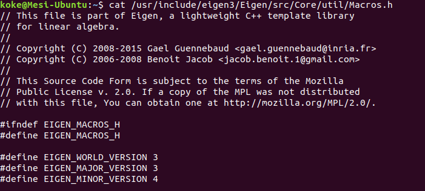
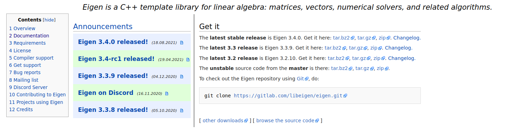
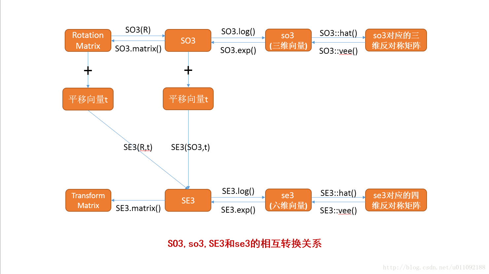

# 从零手写vio课程环境搭建说明

> 注意：这里不保证所有的安装过程都是完全正确的，毕竟每个人的系统和配置可能都不太一样，这里仅提供一个参考给大家，谢谢大家理解

课程作业主要用到这三个库 `Eigen sophus Opencv`，第二章作业安装的code_utils依赖于`ceres`，
第二章作业的kalibr_allan-master需要运行MATLAB来画图，因此需要安装MATLAB 2018版本，具体安装过程这里不详细介绍了，
大家自行安装。（当然不安装MATLAB这章作业也能做，只是推荐用kalibr_allan-master）

因此下面针对**ubuntu 18.04**系统如何安装`Eigen sophus Opencv ceres`做个简单说明

## Eigen安装
`Eigen`主要用来矩阵运算，`sophus`、`ceres`以及`g2o`都用到了`Eigen`库。

从ubuntu软件源直接安装
```c++
sudo apt-get install libeigen3-dev
```
Eigen的头文件默认在 `/usr/include/eigen3/`，可以用下面的命令查看头文件的位置：
```c++
sudo updatedb
locate eigen3
```

`Eigen`只有头文件，没有库文件，因此不需要再用 `tartget_link_libraries` 语句将
程序链接到库上，在使用Eigen库时候，只需在`CMakeLists.txt`引入
```c++
include_directories( "/usr/include/eigen3" )
```

如果你的系统是**ubuntu 16.04**，请注意：
在后面安装`sophus`库时，需要的`eigen`版本至少为3.3.0，而**ubuntu 16.04**支持的eigen库最高版本为3.2.9，
所以不能直接用上述的命令进行安装`eigen`，如果是从ubuntu软件源安装的Eigen，查看其版本可以输入命令 
```c++
cat /usr/include/eigen3/Eigen/src/Core/util/Macros.h
```
下图显示Eigen版本为3.3.4


如果版本低于3.3.0，请自行到Eigen官网 https://eigen.tuxfamily.org/index.php?title=Main_Page 
下载高版本的压缩包tar.gz



把压缩包放到你想放到的位置，进行解压编译
```c++
tar -zxvf FileName.tar.gz
mkdir build
cd build
cmake ..
sudo make install
```

安装成功的话，你会在 `/usr/local/include` 路径下看到eigen的文件夹

Eigen的`CMakeLists.txt`改为:
```c++
include_directories( "/usr/local/include/eigen3" )
```

>下面简要说一下`Eigen`的主要模块：

1. `core`： `#include<Eigen/Core>`, 包含Matrix和Array类，基础的线性代数运算和数组操作
2. `Geometry`： `#include<Eigen/Geometry>`，包含旋转，平移缩放，二维和三维的各种变换
3. `LU` ：`#include<Eigen/LU>`，包含求逆，行列式，LU分解 
4. `Cholesky`： `#include<Eigen/Cholesky>`，包含LLT和LDLT Cholesky分解 
5. `SVD`： `#include<Eigen/SVD>`，包含SVD分解 
6. `QR`： `#include<Eigen/QR>`，包含QR分解 
7. `Eigenvalues` ：`#include<Eigen/Eigenvalues>`，包含特征值，特征向量分解。 
8. `Sparse`： `#include<Eigen/Sparse>`，包含稀疏矩阵的存储和运算
9.` Dense` ：`#include<Eigen/Dense>`，包含了 Core/Geometry/LU/Cholesky/SVD/QR/Eigenvalues模块 
9. `Eigen`： `#include<Eigen/Eigen>`，包含Dense和Sparse（包含所有的Eigen模块）


## sophus安装

`Eigen`库提供了集合模块，但没有提供李代数的支持。一个较好的李群和李代数的库是`Sophus`库，它很好的支持了`SO(3)`,`so(3)`,`SE(3)`和`se(3)`

Sophus 早期版本只提供了**双精度**的李群/李代数类。
后续版本改写成了模板类。模板类的 Sophus 中可以使用**不同精度**的李群/李代数，但同时
增加了使用难度，使用模板类需要声明类型，比如模板类 `Sophus::SO3<double> SO3_R;`，
非模板类 `Sophus::SO3 SO3_R;`，课程作业代码内带了模板类的`Sophus`头文件，直接编译代码就能使用，但这里还是建议大家都安装一下模板类的`Sophus`

> 安装模板类的`Sophus` 库：

安装依赖库fmt：
```c++
git clone  https://github.com/fmtlib/fmt.git
cd fmt
mkdir build
cd build
cmake ..
make
sudo make install

```

在终端打开，输入以下命令：
```c++
git clone https://github.com/strasdat/Sophus.git
cd Sophus/
mkdir build
cd build
cmake ..
make
sudo make install

```
CMakeLists.txt文件：
`sophus`库依赖`Eigen`库，因此要把`Eigen`库也带上
```c++
cmake_minimum_required(VERSION 3.19)
project(hwCH1)

#Eigen
include_directories("/usr/include/eigen3")

#sophus
find_package( Sophus REQUIRED )
include_directories("/usr/include/eigen3")
include_directories(${Sophus_INCLUDE_DIRS})
add_executable(project_name main.cpp)            #注意修改自己的project_name和main.cpp名称
target_link_libraries( project_name ${Sophus_LIBRARIES} fmt)
```


> 安装非模板的 `Sophus` 库，需要回滚到`a621ff`版本：

```c++
git clone https://github.com/strasdat/Sophus.git
cd Sophus
git checkout a621ff
mkdir build
cd build
cmake ..
make
```

CMakeLists.txt文件：

```c++
#Eigen
include_directories("/usr/include/eigen3")

#sophus
find_package( Sophus REQUIRED )
include_directories( ${Sophus_INCLUDE_DIRS} )
add_executable( project_name main.cpp )  #注意修改自己的project_name和main.cpp名称
target_link_libraries( project_name ${Sophus_LIBRARIES} )
```

> 简要说一下sophus的模块

头文件：
```c++
#include <Eigen/Core>
#include <Eigen/Geometry>

#include "sophus/so3.hpp"
#include "sophus/se3.hpp"
```

1. 李群SO3 `Sophus::SO3<double>`，SO(3)是3X3的旋转矩阵
2. 李群SE3 `Sophus::SE3<double>`，SE(3)是4X4的位姿矩阵
3. 李群SO3对应的李代数so3 `Sophus：：Vector3d`，so(3)是一个3维向量
4. 李群SE3对应的李代数se3 `Sophus：：Vector6d`，se(3)是一个6维向量


下面这张图片很好描述了SO3、so3、SE3与se3的相互转换关系


图片来源：https://guyuehome.com/34708

## openCV安装

OpenCV提供了大量的开源视觉算法库，是计算机视觉中使用极其广泛的图像处理算法库。课程代码安装openCV 3.2就可以了

首先安装openCV的依赖库
```c++
sudo apt-get install build-essential
sudo apt-get install libgtk2.0-dev 
sudo apt-get install libvtk5-dev 
sudo apt-get install libjpeg-dev 
sudo apt-get install libtiff4-dev 
sudo apt-get install libjasper-dev 
sudo apt-get install libopenexr-dev 
sudo apt-get installlibtbb-dev
```

到官网 https://opencv.org/releases.html 查找对应的openCV版本，点击source下载zip压缩包，解压后进行编译：
```c++
cd XXX    #XXX表示OpenCV解压后的文件夹
mkdir build
cd build
cmake ..
make
sudo make install
```

CMakeLists.txt文件：
```c++
set(CMAKE_CXX_FLAGS "-std=c++11")                          #添加c++11标准支持

find_package( OpenCV REQUIRED )                            #寻找OpenCV库
include_directories( ${OpenCV_INCLUDE_DIRS})                #添加头文件 

add_executable( imageBasics imageBasics.cpp)                #添加可执行文件
target_link_libraries( imageBasics ${OpenCV_LIBS} )         #链接OpenCV库
```

## ceres安装
要求Eigen库3.3以上，CMake 3.5以上

安装依赖库：

```c++
sudo apt-get install cmake
sudo apt-get install libgoogle-glog-dev libgflags-dev
sudo apt-get install libatlas-base-dev
sudo apt-get install libeigen3-dev            #如果前面已经安装好Eigen, 这一步跳过
sudo apt-get install libsuitesparse-dev
```
安装依赖库如果遇到无法定位libcxsoarse3.1.2的问题，请参考 https://blog.csdn.net/Coderii/article/details/87601836

然后下载安装包，编译

```c++
git clone https://github.com/ceres-solver/ceres-solver.git
mkdir ceres-bin
cd ceres-bin
cmake ../ceres-solver
make -j3
make test
sudo make install
```

检查是否安装上：

```c++
bin/simple_bundle_adjuster ../ceres-solver/data/problem-16-22106-pre.txt
```


CMakeLists.txt文件：
```c++
# 添加cmake模块以使用ceres库
list( APPEND CMAKE_MODULE_PATH ${PROJECT_SOURCE_DIR}/cmake_modules )
find_package( Ceres REQUIRED )
include_directories( ${CERES_INCLUDE_DIRS})                     #添加头文件目录 

add_executable( project_name main.cpp )                        #添加可执行文件
target_link_libraries( project_name ${CERES_LIBRARIES} )       #添加库文件目录
```


参考资料：
1. 视觉slam14讲
2. https://www.guyuehome.com/34670
3. https://blog.csdn.net/u011092188/article/details/77833022
4. https://blog.csdn.net/weixin_44684139/article/details/104803225
5. https://blog.csdn.net/HZ490727/article/details/80866894#3-opencv
6. http://ceres-solver.org/installation.html
7. https://blog.csdn.net/Coderii/article/details/87601836